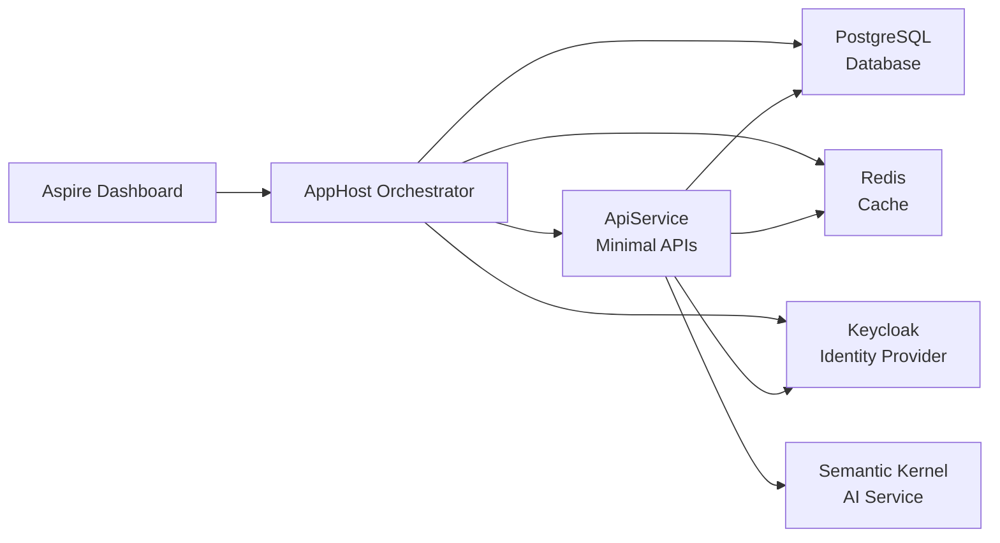

# NinetyNine -- Spiritual Health & Church CRM

[](https://dotnet.microsoft.com)
[](https://aspire.dev)
[](https://creativecommons.org/licenses/by-nc-sa/4.0/)
[](https://github.com/mayorgacdev/ninety-nine/pulls)
[](https://github.com/mayorgacdev/ninety-nine)

> "What man of you, having a hundred sheep, if he loses one of them, does not leave the ninety-nine in the wilderness, and go after the one which is lost until he finds it?" -- Luke 15:4

---

## Table of Contents

- [About](#about-the-project)
- [Features](#core-features)
- [Architecture](#architecture)
- [Project Structure](#project-structure)
- [Technology Stack](#technology-stack)
- [Roadmap](#roadmap)
- [Getting Started](#getting-started)
- [Running Tests](#running-tests)
- [Deployment](#deployment)
- [Useful Commands](#useful-commands)
- [Privacy & Security](#privacy--security-hipaa-inspired)
- [Contributing](#contributing)
- [Code of Conduct](#code-of-conduct)
- [Support](#support)
- [License](#license)

---

## About the Project

The church is a hospital for mortals. As human beings, our memory is limited, but our mission to care for souls requires precision, love, and diligence. **NinetyNine** is a highly specialized Customer Relationship Management (CRM) system built specifically for churches, acting as a **Spiritual Clinical Record**.

Its primary goal is to prioritize souls for Christ. By tracking "spiritual vitals" and counseling history, the system empowers pastors and leaders to proactively care for their congregation, ensuring that no soul slips through the cracks due to human forgetfulness.

This project is built on **.NET Aspire**, a cloud-native distributed application platform that orchestrates services, databases, cache, and identity providers.

## Core Features

- **Admissions (Visitor Registration):** Ultra-fast data entry for new visitors, capturing their contact info, prayer requests, and whoever invited them.
- **Spiritual Clinical History (Triage):** Securely log pastoral counseling notes, spiritual milestones (discipleship, baptism), and active ministry service.
- **Spiritual Vitals (Attendance & Engagement):** Seamlessly track attendance at main services and small groups.
- **The "Rescue" Alert System:** The heart of the app. An automated dashboard that flags members who are showing signs of spiritual sickness (e.g., missed 3 consecutive weeks, recent family crisis logged in triage) and assigns them for an immediate pastoral visit.
- **Geolocated Care:** Map integration to help leaders group their pastoral visits efficiently by neighborhood.

## Architecture

The system follows a **distributed application architecture** orchestrated by .NET Aspire:



Each service runs as an independent container managed by Aspire, enabling seamless service discovery, health checks, and OpenTelemetry-based observability.

## Project Structure

```
NinetyNine/
├── NinetyNine.AppHost/              # .NET Aspire orchestrator
│   ├── AppHost.cs                   # Entry point, resource graph definition
│   └── NinetyNine.AppHost.csproj    # Project file (Aspire.AppHost.Sdk)
├── NinetyNine.ApiService/           # Backend API (Minimal APIs)
│   └── NinetyNine.ApiService.csproj
├── NinetyNine.ServiceDefaults/      # Shared OpenTelemetry, resilience, service discovery
│   └── NinetyNine.ServiceDefaults.csproj
├── .agents/skills/                  # AI coding agent skill definitions
├── NinetyNine.slnx                  # Solution file
├── aspire.config.json               # Aspire CLI configuration
├── nuget.config                     # NuGet package sources
├── CODE_OF_CONDUCT.md               # Community guidelines
└── LICENSE                          # CC BY-NC-SA 4.0
```

## Technology Stack

| Component           | Technology / Framework             | Purpose                                              |
| ------------------- | ---------------------------------- | ---------------------------------------------------- |
| **Orchestration**   | .NET Aspire 13.4                   | Cloud-native distributed app platform.               |
| **Backend**         | .NET 10 / C# (Minimal APIs)        | Lightweight, high-performance endpoints.             |
| **Architecture**    | Vertical Slice Architecture        | Keeps domain logic decoupled and maintainable.       |
| **Database**        | Entity Framework Core / PostgreSQL | Manages complex relational data (families, leaders). |
| **Cache**           | Redis (Aspire.Hosting.Redis)       | In-memory caching and session state.                 |
| **Auth & Security** | Keycloak                           | Centralized identity and access management (IAM).    |
| **AI Integration**  | Semantic Kernel                    | Natural language search for pastoral insights.       |
| **Observability**   | OpenTelemetry                      | Distributed tracing, metrics, and logs.              |
| **Frontend**        | [React Native / Flutter / Blazor]  | Mobile-first approach for leaders on the field.      |

## Roadmap

Planned enhancements for upcoming releases:

- [ ] **Admin Dashboard** -- Web-based UI for pastors and leadership.
- [ ] **Mobile App** -- React Native or Flutter app for on-the-go access.
- [ ] **Small Group Management** -- Track cell groups, leaders, and attendance.
- [ ] **Financial Module** -- Tithes, offerings, and donation receipts.
- [ ] **SMS & Email Integration** -- Automated outreach and prayer chain notifications.
- [ ] **Calendar & Events** -- Church-wide event scheduling and registration.
- [ ] **API Public Documentation** -- OpenAPI / Swagger endpoint reference.

> See the [open issues](https://github.com/mayorgacdev/ninety-nine/issues) for a full list of proposed features and known issues.

## Getting Started

### Prerequisites

- [.NET 10.0 SDK](https://dotnet.microsoft.com/download) or higher
- [Aspire CLI](https://aspire.dev/) (`dotnet tool install -g Aspire.Cli`)
- Docker Desktop (for PostgreSQL, Redis, and Keycloak containers)
- Visual Studio 2022, VS Code, or Rider

### Installation

1. Clone the repository:

```bash
git clone https://github.com/mayorgacdev/ninety-nine.git
cd ninety-nine
```

2. Restore dependencies:

```bash
dotnet restore
```

3. Start the Aspire AppHost (this will orchestrate all services via Docker):

```bash
aspire start
```

4. Wait for all resources to be ready:

```bash
aspire wait NinetyNine.ApiService
```

5. The Aspire dashboard will open automatically. Access the API at the endpoint shown in `aspire describe`.

## Running Tests

```bash
# Run all tests
dotnet test

# Run tests with verbose output
dotnet test --verbosity detailed

# Run tests with code coverage
dotnet test --collect:"XPlat Code Coverage"
```

## Deployment

### Local Development

Use `aspire start` for local containerized development. All dependencies (PostgreSQL, Redis, Keycloak) spin up automatically via Docker.

### Production

For production deployment, Aspire supports multiple targets:

- **Docker Compose** -- `aspire publish` generates `docker-compose.yaml` artifacts.
- **Kubernetes / AKS** -- `aspire deploy` provisions Helm charts to a Kubernetes cluster.
- **Azure Container Apps** -- Cloud-native serverless containers with built-in scaling.

> See the [Aspire deployment documentation](https://aspire.dev/docs/deployment) for detailed guides.

## Useful Commands

| Command                       | Description                               |
| ----------------------------- | ----------------------------------------- |
| `aspire start`                | Start the entire distributed application. |
| `aspire stop`                 | Stop all running resources.               |
| `aspire ps`                   | List running resources and their status.  |
| `aspire describe`             | Show detailed resource information.       |
| `aspire wait <resource>`      | Wait for a specific resource to be ready. |
| `aspire resource logs <name>` | View logs for a specific resource.        |
| `aspire update`               | Update Aspire package references.         |
| `dotnet test`                 | Run the test suite.                       |

## Privacy & Security (HIPAA-inspired)

Just like a real hospital, spiritual health records contain highly sensitive and confidential information. **NinetyNine** implements strict role-based access control (RBAC) through **Keycloak**. Only authorized counselors and head pastors can access triage notes, while small group leaders only see basic vitals and attendance.

All network communication is encrypted in transit. Audit logs track who accessed which record and when.

## Contributing

We believe that technology can be a powerful tool for the Kingdom. If you want to contribute to **NinetyNine**, please fork the repository and create a pull request with your proposed changes.

1. Fork the Project
2. Create your Feature Branch (`git checkout -b feature/AmazingFeature`)
3. Commit your Changes (`git commit -m 'Add some AmazingFeature'`)
4. Push to the Branch (`git push origin feature/AmazingFeature`)
5. Open a Pull Request

For major changes, please open an issue first to discuss what you would like to change.

## Code of Conduct

This project adheres to the [Contributor Covenant](https://www.contributor-covenant.org/) Code of Conduct. By participating, you are expected to uphold this code. Please report unacceptable behavior to the project maintainers.

See `CODE_OF_CONDUCT.md` for the full text.

## Support

- **Issues:** [GitHub Issues](https://github.com/mayorgacdev/ninety-nine/issues) -- Bug reports and feature requests.
- **Discussions:** [GitHub Discussions](https://github.com/mayorgacdev/ninety-nine/discussions) -- Questions and ideas.
- **Security:** For security vulnerabilities, please open a private issue or contact the maintainers directly.

## License

Distributed under the **Creative Commons Attribution-NonCommercial-ShareAlike 4.0 International License** (CC BY-NC-SA 4.0). See `LICENSE` for more information.

[](https://creativecommons.org/licenses/by-nc-sa/4.0/)
